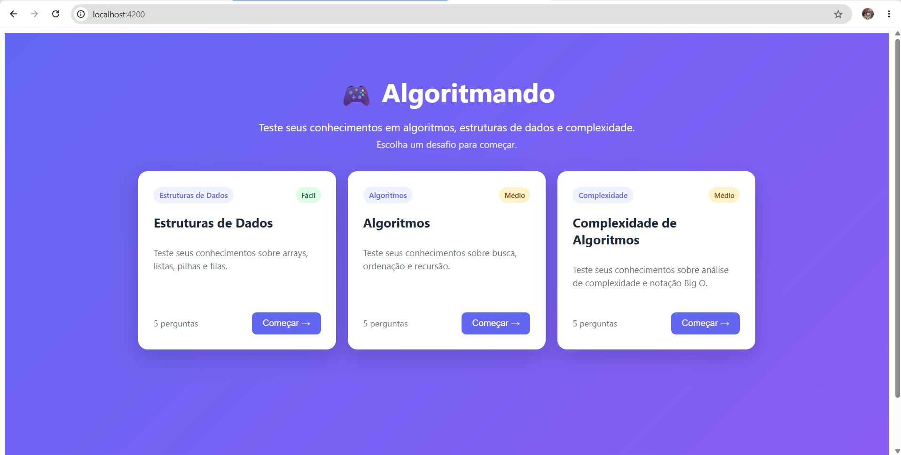
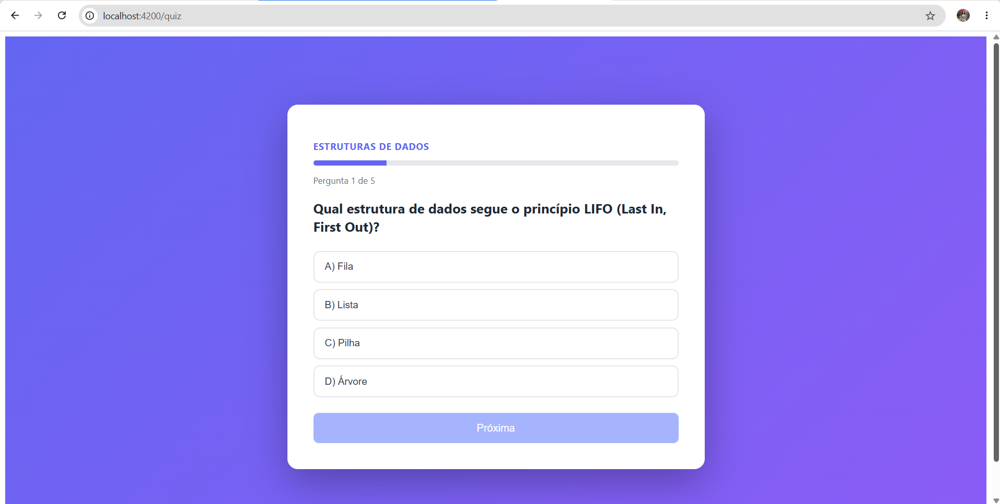
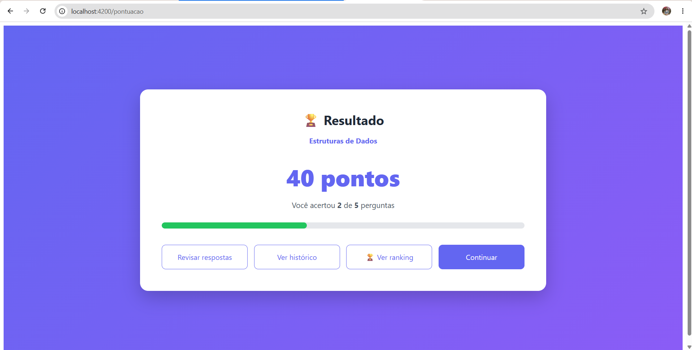
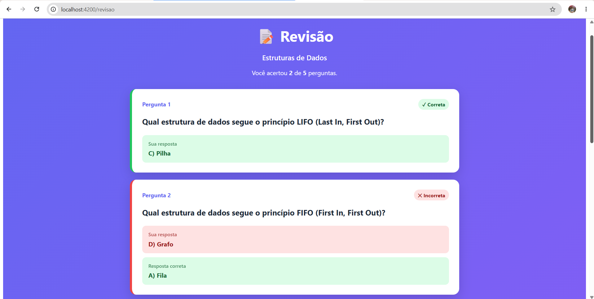
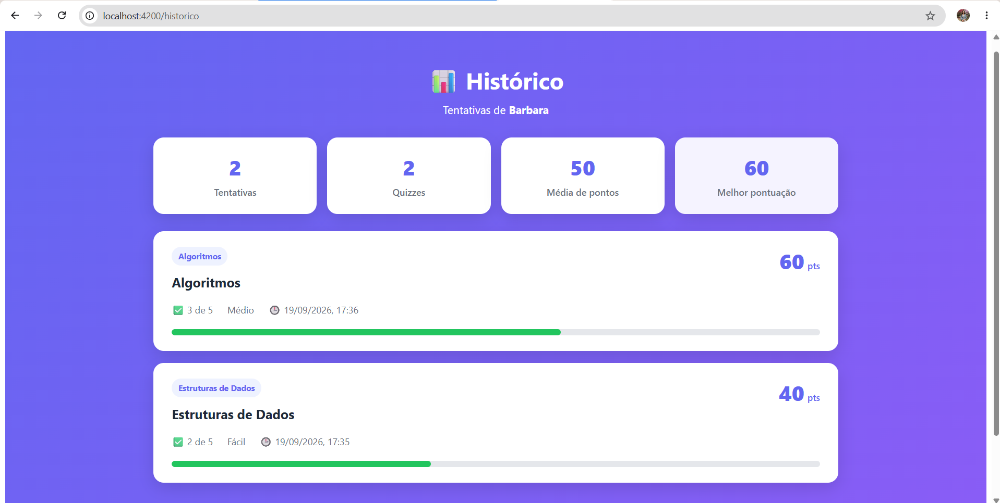
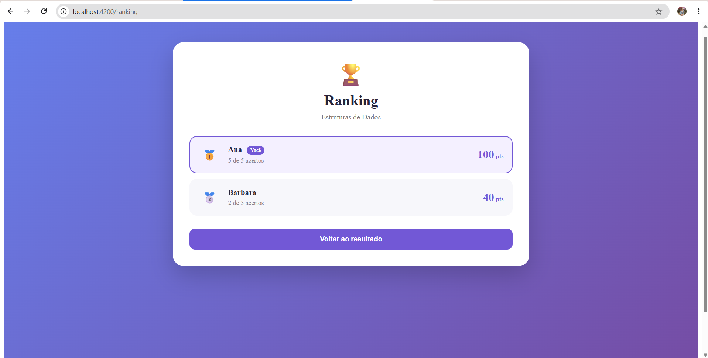

# 🎮 Algoritmando

Aplicação web de quizzes voltada ao aprendizado de conceitos de **Algoritmos, Estruturas de Dados e Complexidade de Algoritmos**.

O usuário pode escolher diferentes quizzes, responder perguntas, visualizar sua pontuação, revisar as respostas, acompanhar seu histórico de tentativas, consultar estatísticas de desempenho e comparar sua melhor pontuação em um ranking.

O projeto foi desenvolvido utilizando **Angular** no frontend e **Spring Boot** no backend, com persistência de dados, validações em múltiplas camadas e testes automatizados.

---

<a id="sumario"></a>

# 📑 Sumário

- [🚀 Execução rápida](#execucao-rapida)
- [📸 Demonstração](#demonstracao)
- [🔄 Fluxo da aplicação](#fluxo)
- [💻 Execução sem Docker](#execucao-manual)
- [🌐 API REST](#api)
- [🏆 Ranking](#ranking)
- [📊 Desempenho](#desempenho)
- [✅ Validações](#validacoes)
- [💾 Persistência](#persistencia)
- [🐳 Docker](#docker)
- [🚀 Possíveis evoluções futuras](#evolucoes)
- [👩‍💻 Autora](#autora)

---

<a id="execucao-rapida"></a>

# 🚀 Execução rápida

A forma recomendada de executar o projeto é utilizando **Docker Compose**. Também está disponível outra forma de execução, sem utilizar Docker Compose.

## Pré-requisitos

Para executar dessa forma, é necessário possuir:

- Docker
- Docker Compose

> Não é necessário instalar Java, Maven, Node.js ou Angular CLI localmente.

### 1. Clone o repositório

```bash
git clone https://github.com/barbaradsp/algoritmando.git
```

Entre na pasta:

```bash
cd algoritmando
```

### 2. Suba a aplicação

```bash
docker compose up --build
```

Na primeira execução, o Docker irá:

1. construir o backend;
2. executar os testes automatizados do backend;
3. gerar o arquivo executável da aplicação Spring Boot;
4. instalar as dependências do frontend;
5. gerar o build de produção do Angular;
6. configurar o Nginx;
7. iniciar frontend e backend;
8. criar o volume persistente utilizado pelo banco H2.

### 3. Acesse a aplicação

**Frontend**

```text
http://localhost:4200
```

**Backend**

```text
http://localhost:8080
```

### Parar a aplicação

```bash
docker compose down
```

Os dados permanecem armazenados no volume Docker.

Para remover também os dados persistidos:

```bash
docker compose down -v
```

> ⚠️ O comando `docker compose down -v` remove os dados armazenados no banco.


---

<a id="demonstracao"></a>

# 📸 Demonstração

As imagens da aplicação podem ser armazenadas em:

```text
docs/images/
```

## Tela inicial



## Cadastro


## Quiz



## Resultado



## Revisão das respostas



## Histórico e desempenho



## Ranking



---

<a id="fluxo"></a>

# 🔄 Fluxo da aplicação

O fluxo principal é:

```text
Tela inicial
     ↓
Escolha do quiz
     ↓
Cadastro / identificação do usuário
     ↓
Carregamento das perguntas
     ↓
Resposta das perguntas
     ↓
Envio ao backend
     ↓
Validação
     ↓
Cálculo da pontuação
     ↓
Persistência do resultado
     ↓
Tela de resultado
```

Após o resultado, o usuário pode acessar:

```text
                 Resultado
                    │
        ┌───────────┼───────────┐
        ↓           ↓           ↓
     Revisão     Histórico    Ranking
                    │
                    ↓
               Desempenho
```

---

<a id="execucao-manual"></a>

# 💻 Execução sem Docker

Também é possível executar frontend e backend manualmente.

---

## Backend

### Requisito

- Java 21

Entre na pasta:

```bash
cd backend
```

### Linux, macOS ou Git Bash

```bash
./mvnw spring-boot:run
```

### Windows CMD ou PowerShell

```powershell
mvnw.cmd spring-boot:run
```

O backend ficará disponível em:

```text
http://localhost:8080
```

---

## Frontend

### Requisitos

- Node.js
- npm

Entre na pasta:

```bash
cd frontend
```

Instale as dependências:

```bash
npm install
```

Inicie a aplicação:

```bash
npm start
```

O frontend ficará disponível em:

```text
http://localhost:4200
```

---

<a id="api"></a>

# 🌐 API REST

Base URL:

```text
http://localhost:8080/api
```

---

## Usuários

### Cadastrar usuário

```http
POST /api/usuarios
```

Exemplo de requisição:

```json
{
  "nome": "Barbara",
  "email": "barbara@email.com"
}
```

Exemplo de resposta:

```json
{
  "id": 1,
  "nome": "Barbara",
  "email": "barbara@email.com"
}
```

Caso o e-mail já exista, o usuário existente é reutilizado.

---

## Quizzes

### Listar quizzes

```http
GET /api/quizzes
```

Exemplo de resposta:

```json
[
  {
    "id": 1,
    "titulo": "Estruturas de Dados",
    "descricao": "Conceitos fundamentais de estruturas de dados",
    "categoria": "ESTRUTURAS_DE_DADOS",
    "dificuldade": "FACIL",
    "quantidadePerguntas": 5
  }
]
```

---

### Listar perguntas de um quiz

```http
GET /api/quizzes/{quizId}/perguntas
```

Exemplo:

```http
GET /api/quizzes/1/perguntas
```

---

### Ranking de um quiz

```http
GET /api/quizzes/{quizId}/ranking
```

Exemplo:

```http
GET /api/quizzes/1/ranking
```

O ranking utiliza somente a melhor tentativa de cada usuário.

---

## Resultados

### Registrar resultado

```http
POST /api/resultados
```

Exemplo:

```json
{
  "usuarioId": 1,
  "quizId": 1,
  "respostas": [
    {
      "perguntaId": 1,
      "respostaEscolhida": "A"
    },
    {
      "perguntaId": 2,
      "respostaEscolhida": "C"
    }
  ]
}
```

O backend:

1. valida o usuário;
2. valida o quiz;
3. busca as perguntas daquele quiz;
4. verifica se as perguntas enviadas pertencem ao quiz;
5. verifica respostas duplicadas;
6. valida as alternativas;
7. calcula os acertos;
8. calcula a pontuação;
9. salva o resultado;
10. retorna os dados de revisão.

---

### Histórico

```http
GET /api/resultados/historico?email={email}
```

Exemplo:

```http
GET /api/resultados/historico?email=barbara@email.com
```

As tentativas são retornadas da mais recente para a mais antiga.

---

### Desempenho

```http
GET /api/resultados/desempenho?email={email}
```

Exemplo:

```http
GET /api/resultados/desempenho?email=barbara@email.com
```

Exemplo de resposta:

```json
{
  "totalTentativas": 5,
  "quizzesRealizados": 3,
  "mediaPontuacao": 76,
  "melhorPontuacao": 100
}
```

---

<a id="ranking"></a>

# 🏆 Ranking

Cada quiz possui seu próprio ranking.

O usuário pode realizar o mesmo quiz várias vezes, porém aparece apenas uma vez no ranking.

É utilizada sua **melhor tentativa**.

Exemplo:

```text
Barbara → 60 pontos
Ana     → 80 pontos
Barbara → 100 pontos
Lucas   → 40 pontos
```

Ranking:

```text
1. Barbara → 100 pontos
2. Ana     → 80 pontos
3. Lucas   → 40 pontos
```

A tentativa de 60 pontos de Barbara continua armazenada no histórico, mas não gera uma segunda posição.

Atualmente o ranking apresenta os **10 melhores usuários** de cada quiz.

O usuário atual também recebe destaque visual na interface.

---

<a id="desempenho"></a>

# 📊 Desempenho

A aplicação gera automaticamente um resumo de desempenho individual.

São calculados:

- total de tentativas;
- quantidade de quizzes diferentes realizados;
- média das pontuações;
- melhor pontuação.

Exemplo:

```text
Estruturas de Dados → 40
Algoritmos          → 60
Algoritmos          → 100
Complexidade        → 80
```

Resultado:

```text
Tentativas:        4
Quizzes:           3
Média:             70
Melhor pontuação:  100
```

A quantidade de quizzes considera quizzes distintos.

Assim:

```text
Algoritmos → 60
Algoritmos → 100
```

representa:

```text
2 tentativas
1 quiz realizado
```

---

<a id="validacoes"></a>

# ✅ Validações

A aplicação implementa validações tanto no frontend quanto no backend.

Essa abordagem evita depender exclusivamente da interface para garantir a integridade dos dados.

---

## Validação no frontend

O formulário de cadastro utiliza **Angular Reactive Forms**.

São validados:

- nome obrigatório;
- nome contendo apenas espaços;
- tamanho mínimo e máximo do nome;
- e-mail obrigatório;
- formato do e-mail;
- tamanho máximo do e-mail.

As mensagens são apresentadas diretamente abaixo do campo correspondente.

Exemplos:

```text
O nome é obrigatório.
```

```text
O nome deve ter pelo menos 2 caracteres.
```

```text
Informe um e-mail válido.
```

---

## Validação no backend

O backend utiliza Bean Validation. Entre validações feitas estão: campo nulo, tamanho de nome, e-mail incorreto.

Exemplos de dados rejeitados:

```text
usuarioId = -1
```
```text
nome = "A"
```

```text
email = "banana"
```

A validação do backend continua funcionando mesmo que a API seja chamada diretamente, sem passar pelo Angular.

---

<a id="persistencia"></a>

# 💾 Persistência

O projeto utiliza H2 configurado em modo de arquivo.

Configuração:

```properties
spring.datasource.url=jdbc:h2:file:./data/algoritmando
```

Isso significa que os dados não são perdidos quando o Spring Boot é reiniciado.

---

## Execução local

O banco fica armazenado em:

```text
backend/data/
```

A pasta é ignorada pelo Git:

```gitignore
backend/data/
```

Assim, arquivos locais do banco não são enviados para o repositório.

---

## Execução com Docker

O Docker Compose utiliza um volume persistente:

```text
algoritmando-data
```

Os dados permanecem mesmo após:

```bash
docker compose down
```

Para excluir o volume:

```bash
docker compose down -v
```

---

<a id="evolucoes"></a>

# 🚀 Possíveis evoluções futuras

O projeto pode evoluir com funcionalidades como:

- autenticação de usuários;
- cadastro de senha;
- recuperação de senha;
- perfis de usuário;
- painel administrativo;
- criação de quizzes pela interface de acordo com o perfil do usuário;
- edição de quizzes;
- criação de perguntas;
- filtros avançados no histórico;
- estatísticas por categoria;
- estatísticas por dificuldade;
- evolução da pontuação ao longo do tempo;


---

<a id="autora"></a>

# 👩‍💻 Autora

**Bárbara dos Santos Pimenta**

Projeto desenvolvido para fins acadêmicos no curso de **Engenharia de Software**.
